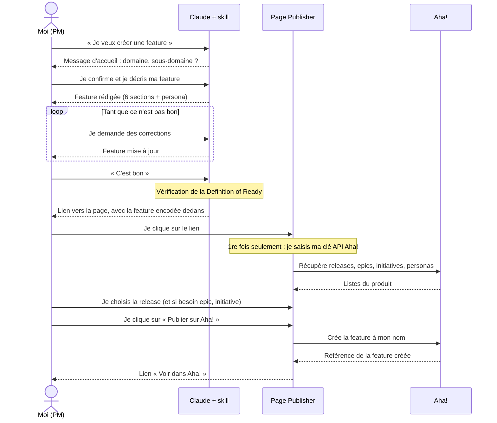
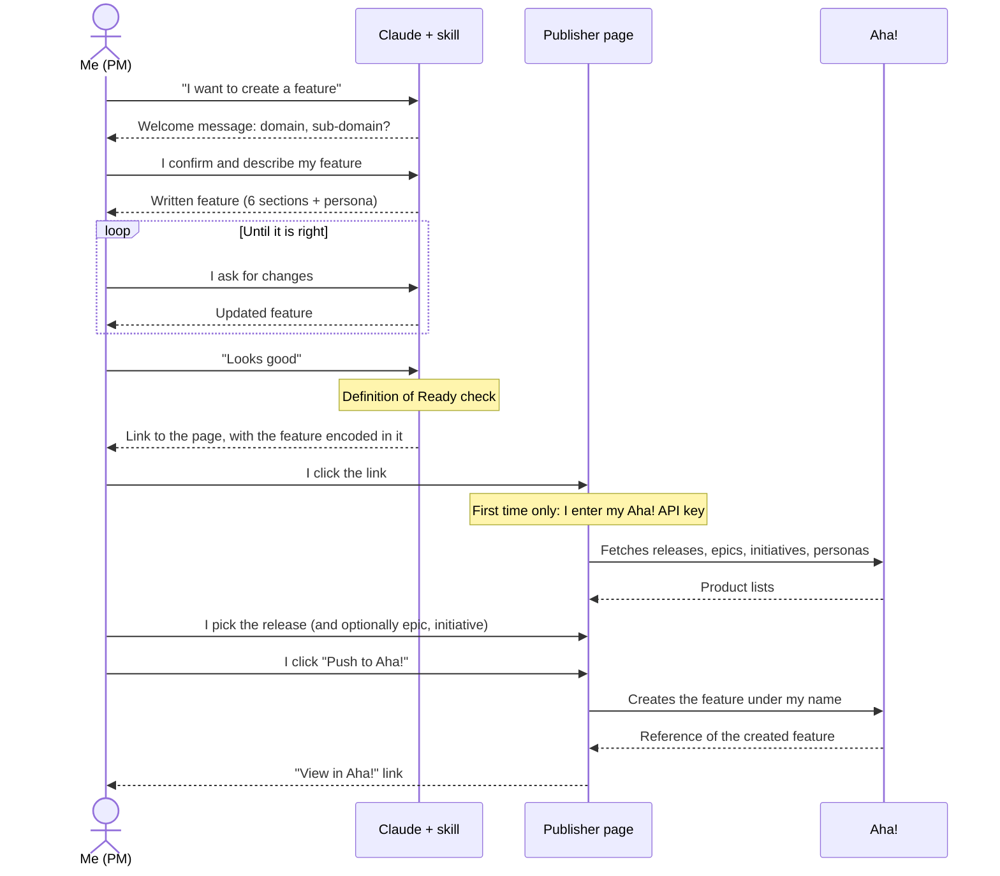

# Aha! Feature Publisher

[Français](#français) · [English](#english)

Page : https://berenaud.github.io/cegid-retail/aha/

---

## Français

### Ce que contient ce dossier

- `index.html` : la page qui publie une feature dans Aha!.
- `skill/cegid-retail-feature-generator/` : le skill Claude qui rédige la feature et génère le lien vers la page.

### Fonctionnement



En détail :

1. Dans Claude, le skill aide le PM à rédiger la feature, vérifie la Definition of Ready, puis génère un lien vers la page.
2. La feature est encodée dans le lien, après `#data=`. Cette partie n'est jamais envoyée au serveur : la feature ne transite pas par GitHub.
3. La page récupère les releases, épics, initiatives et personas du produit via l'API de `cegid.aha.io`.
4. Le PM choisit la release (et si besoin l'épic et l'initiative), puis clique sur « Push to Aha! ». La feature est créée à son nom.

Ouverte sans lien généré par le skill, la page affiche un écran « pas de données ». C'est normal.

### Installer le skill dans Claude

Le titre de cette section sert de lien depuis le skill et la page : ne pas le renommer.

**1. Récupérer le skill**

Télécharger le zip : [cegid-retail-feature-generator.zip](https://github.com/berenaud/cegid-retail/releases/download/skill-latest/cegid-retail-feature-generator.zip). Ne pas le décompresser, il s'installe tel quel.

Ce zip est reconstruit automatiquement à chaque modification du skill (workflow `Package skill`, onglet Actions).

**2. Préparer Claude (une seule fois)**
Dans Claude, aller dans **Settings > Capabilities** et vérifier que **Code execution and file creation** est activé. Les skills ne fonctionnent pas sans.

Conseil : ajouter ses valeurs Aha! dans ses préférences Claude (**Settings > Profile**), par exemple « Aha! : Back / CRM ». Le skill les reprend automatiquement au lieu de les demander. Les tags sont déduits tout seuls (voir « Tags » plus bas).

**3. Installer**
1. Aller dans **Customize > Skills** (sur certaines versions de Claude : **Settings > Capabilities**, section Skills).
2. Cliquer sur **Upload skill** et choisir le zip.
3. Vérifier que le skill est activé (interrupteur).

**4. Vérifier**
Dans une nouvelle conversation, écrire par exemple « Je veux créer une feature ». Claude doit répondre avec le message d'accueil du skill, qui affiche ou demande le domaine et le sous-domaine.

**Mettre à jour**
Quand une nouvelle version est disponible (signalée par le skill au début d'une conversation, ou dans le footer de la page), supprimer l'ancienne version du skill dans Claude, puis refaire les étapes 1 et 3. Supprimer d'abord évite d'avoir deux versions actives en même temps.

### Tags

Le PM ne saisit plus de tag. Le skill en déduit deux à partir du domaine et du sous-domaine : `Domaine {Domaine}` et `Team {Sous-domaine}` (par exemple « Domaine Back » et « Team CRM »).

Le skill affiche toujours les tags qu'il va ajouter. Si la règle ne correspond pas à l'équipe, on précise ses tags dans ses préférences Claude, après « Tags : » : « Aha! : Back / CRM / Tags : Domaine Back, Team CRM Fidélité ». On peut aussi les corriger en cours de conversation.

Avant publication, la page vérifie que chaque tag existe déjà dans Aha! :
- trouvé : il est envoyé, avec l'orthographe exacte d'Aha! (une différence de majuscules est corrigée) ;
- introuvable : il est barré dans l'aperçu et n'est pas envoyé, pour ne jamais créer de mauvais tag.

L'API Aha! ne permet pas de lister les tags. La page cherche donc une feature qui porte déjà ce tag. Conséquence : un tag créé dans Aha! mais jamais utilisé sur une feature est vu comme introuvable. Il suffit de l'ajouter à la main sur la feature une première fois.

### Première utilisation : le token Aha!

Chaque utilisateur utilise sa propre clé API Aha!, à créer dans Aha! : **Settings > Developer > API Keys** (`https://cegid.aha.io/settings/api_keys`).

- La clé est saisie une fois, puis gardée dans le stockage local du navigateur.
- Elle n'est envoyée qu'à `cegid.aha.io`.
- Les droits de la clé s'appliquent : on ne peut publier que là où son compte Aha! a les droits.
- Le bouton « Effacer le token » la supprime du navigateur.

### Versions

- **Page** : le footer affiche la date du dernier commit qui a modifié `aha/index.html`, avec un lien vers ce commit. L'information est gardée en cache 10 minutes, le bouton ↻ force sa mise à jour.
- **Skill** : sa version est la date `metadata.updated` du `SKILL.md` (format AAAA-MM-JJ), à mettre à jour à chaque modification. Elle est transmise dans le lien et affichée dans le footer de la page.
- **Mise à jour du skill** : si la version publiée sur GitHub est plus récente que celle utilisée, le skill le signale au début de la conversation, et la page l'indique dans son footer avec un lien vers ce guide.

Si la page elle-même semble ancienne après une mise à jour : rechargement forcé avec **Ctrl+Shift+R** (Cmd+Shift+R sur Mac).

### Problèmes fréquents

- **Erreur 401** : clé API invalide ou expirée. Cliquer sur « Changer de token ».
- **Erreur réseau** : vérifier la connexion, puis ouvrir la console du navigateur (F12).
- **Écran « pas de données »** : le lien a été tronqué ou copié sans sa partie `#data=`. Le régénérer depuis le skill.

### Maintenance

- La page tient en un seul fichier, sans dépendance externe.
- Mise à jour : remplacer `aha/index.html`, attendre la fin du déploiement (onglet Actions), tester.
- Les données affichées doivent toujours passer par `escHtml()` ou `textContent`, jamais directement par `innerHTML`.

### Format des données

Le lien contient un JSON encodé en base64url (UTF-8) :

```json
{
  "name": "Back - CRM | Nom de la feature (moins de 80 caractères)",
  "tags": ["Domaine Back", "Team CRM"],
  "product": "RETAILY2",
  "personas": ["Store Cashier"],
  "skill_updated": "2026-09-23",
  "context": "…",
  "objective": "En tant que …\nRésultat attendu : …",
  "included": ["…"],
  "excluded": ["…"],
  "criteria": ["Étant donné …, quand …, alors …"],
  "dependencies": "…",
  "slices": ["…"]
}
```

---

## English

### What this folder contains

- `index.html`: the page that publishes a feature to Aha!.
- `skill/cegid-retail-feature-generator/`: the Claude skill that writes the feature and generates the link to the page.

### How it works



In detail:

1. In Claude, the skill helps the PM write the feature, checks the Definition of Ready, then generates a link to the page.
2. The feature is encoded in the link, after `#data=`. This part is never sent to the server: the feature never goes through GitHub.
3. The page fetches the product's releases, epics, initiatives and personas from the `cegid.aha.io` API.
4. The PM picks the release (and optionally the epic and initiative), then clicks "Push to Aha!". The feature is created under their name.

If opened without a link generated by the skill, the page shows a "no data" screen. This is expected.

### Installing the skill in Claude

The title of this section is linked from the skill and the page: do not rename it.

**1. Get the skill**

Download the zip: [cegid-retail-feature-generator.zip](https://github.com/berenaud/cegid-retail/releases/download/skill-latest/cegid-retail-feature-generator.zip). Do not unzip it, it installs as is.

This zip is rebuilt automatically on every change to the skill (`Package skill` workflow, Actions tab).

**2. Prepare Claude (once)**
In Claude, go to **Settings > Capabilities** and make sure **Code execution and file creation** is enabled. Skills do not work without it.

Tip: add your Aha! values to your Claude preferences (**Settings > Profile**), e.g. "Aha! : Back / CRM". The skill picks them up instead of asking. Tags are derived automatically (see "Tags" below).

**3. Install**
1. Go to **Customize > Skills** (on some versions of Claude: **Settings > Capabilities**, Skills section).
2. Click **Upload skill** and pick the zip.
3. Check that the skill is enabled (toggle).

**4. Check**
In a new conversation, write for instance "I want to create a feature". Claude should answer with the skill's welcome message, showing or asking for the domain and sub-domain.

**Updating**
When a new version is available (flagged by the skill at the start of a conversation, or in the page footer), delete the old version of the skill in Claude, then repeat steps 1 and 3. Deleting first avoids having two active versions at the same time.

### Tags

The PM no longer types a tag. The skill derives two from the domain and sub-domain: `Domaine {Domain}` and `Team {Sub-domain}` (e.g. "Domaine Back" and "Team CRM").

The skill always shows the tags it will add. If the rule does not fit the team, set your tags in your Claude preferences, after "Tags :": "Aha! : Back / CRM / Tags : Domaine Back, Team CRM Fidélité". They can also be corrected during the conversation.

Before publishing, the page checks that each tag already exists in Aha!:
- found: it is sent, with Aha!'s exact spelling (a case difference is fixed);
- not found: it is struck through in the preview and not sent, so a wrong tag is never created.

The Aha! API cannot list tags. The page therefore looks for a feature that already carries the tag. As a result, a tag created in Aha! but never used on a feature is seen as not found. Just add it by hand on the feature the first time.

### First use: your Aha! token

Each user uses their own Aha! API key, created in Aha!: **Settings > Developer > API Keys** (`https://cegid.aha.io/settings/api_keys`).

- The key is entered once, then kept in the browser's local storage.
- It is only sent to `cegid.aha.io`.
- The key's permissions apply: you can only publish where your Aha! account has access.
- The "Clear saved token" button removes it from the browser.

### Versions

- **Page**: the footer shows the date of the last commit that changed `aha/index.html`, linked to that commit. This is cached for 10 minutes; the ↻ button forces a refresh.
- **Skill**: its version is the `metadata.updated` date in `SKILL.md` (YYYY-MM-DD format), to be updated on every change. It is passed in the link and shown in the page footer.
- **Skill updates**: if the version published on GitHub is newer than the one in use, the skill says so at the start of the conversation, and the page shows it in its footer with a link to this guide.

If the page itself looks outdated after an update: hard reload with **Ctrl+Shift+R** (Cmd+Shift+R on Mac).

### Common issues

- **401 error**: invalid or expired API key. Click "Change token".
- **Network error**: check your connection, then open the browser console (F12).
- **"No data" screen**: the link was truncated or copied without its `#data=` part. Generate it again from the skill.

### Maintenance

- The page is a single file with no external dependency.
- Update: replace `aha/index.html`, wait for the deployment to finish (Actions tab), test.
- Displayed data must always go through `escHtml()` or `textContent`, never directly through `innerHTML`.

### Data format

The link contains a base64url-encoded (UTF-8) JSON object:

```json
{
  "name": "Back - CRM | Feature name (under 80 characters)",
  "tags": ["Domaine Back", "Team CRM"],
  "product": "RETAILY2",
  "personas": ["Store Cashier"],
  "skill_updated": "2026-09-23",
  "context": "…",
  "objective": "En tant que …\nRésultat attendu : …",
  "included": ["…"],
  "excluded": ["…"],
  "criteria": ["Étant donné …, quand …, alors …"],
  "dependencies": "…",
  "slices": ["…"]
}
```
