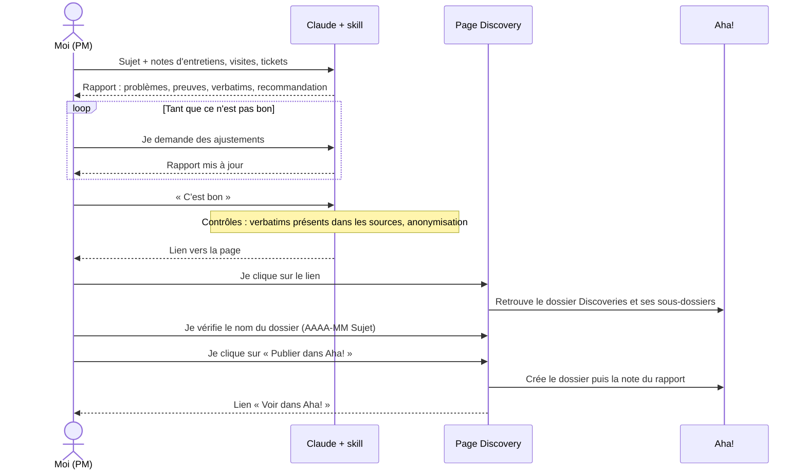
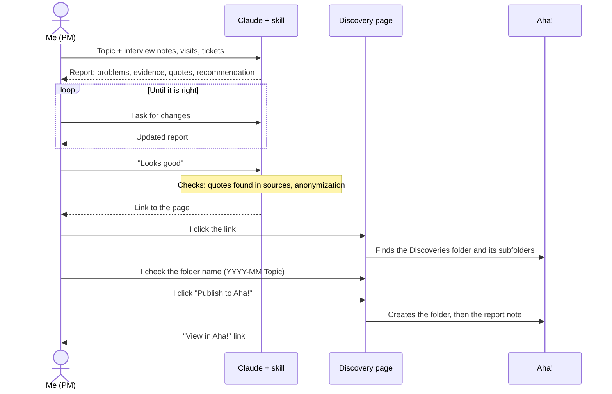

# Aha! Discovery Publisher

[Français](#français) · [English](#english)

Page : https://berenaud.github.io/cegid-retail/aha/discovery/

---

## Français

### Ce que contient ce dossier

- `index.html` : la page qui publie un rapport de discovery dans Aha!, en note.
- `skill/cegid-retail-discovery-report/` : le skill Claude qui analyse le matériel de discovery et rédige le rapport.

### Fonctionnement



En détail :

1. Le rapport est compressé dans le lien, après `#z=`, avec une somme de contrôle (`&c=`) qui permet à la page de détecter un lien abîmé. Cette partie n'est jamais envoyée au serveur : les verbatims ne transitent pas par GitHub. Claude fournit aussi le rapport en fichier `.json`, à déposer sur la page si le lien ne passe pas.
2. Le skill vérifie que chaque verbatim existe mot pour mot dans les sources fournies, et bloque s'il trouve un email ou un numéro de téléphone.
3. La page crée un dossier `AAAA-MM Sujet` dans **Knowledge > Documents > Discoveries**, puis la note du rapport à l'intérieur. Si un dossier du même nom existe déjà, le rapport y est ajouté.
4. Si le même lien a déjà été publié depuis ce navigateur, la page le signale pour éviter un doublon.
5. Les liens vers les documents sources (enregistrements, comptes rendus, tickets) sont cliquables dans la note Aha!, ainsi que la source de chaque verbatim quand elle correspond à un document.

### Prérequis dans Aha!

Un dossier nommé exactement **Discoveries** doit exister dans Knowledge > Documents du workspace (produit `RETAILY2`). Si le menu Documents n'apparaît pas, un propriétaire du workspace peut l'activer dans Settings > Workspace > Navigation.

### Installer le skill dans Claude

Le titre de cette section sert de lien depuis le skill et la page : ne pas le renommer.

1. Télécharger le zip de la dernière version : https://github.com/berenaud/cegid-retail/releases/download/skill-latest/cegid-retail-discovery-report.zip (lien également sur la page d'accueil du site). Ne pas le décompresser : c'est ce fichier qu'on installe. Il est reconstruit automatiquement à chaque modification du skill (workflow `Package skills`, onglet Actions).
2. Dans Claude, vérifier que **Settings > Capabilities > Code execution and file creation** est activé.
3. Aller dans **Customize > Skills** (ou Settings > Capabilities, section Skills), cliquer sur **Upload skill** et choisir le zip. Vérifier qu'il est activé.
4. Tester avec : « Je veux faire une synthèse de discovery ».

**Mise à jour** : supprimer l'ancienne version du skill dans Claude, puis réinstaller le zip, qui est toujours la dernière version.

### Token Aha!

C'est la même clé API que pour la page Aha! Feature Publisher. Si elle y est déjà enregistrée, il n'y a rien à ressaisir.

### Versions

- **Page** : le footer affiche la date du dernier commit qui a modifié `aha/discovery/index.html` ou le code commun `shared/`. Le bouton ↻ force la mise à jour.
- **Skill** : sa version est la date `metadata.updated` du `SKILL.md`, à mettre à jour à chaque modification. Le skill et la page signalent quand une version plus récente est publiée.

### Problèmes fréquents

- **« Dossier Discoveries introuvable »** : le dossier n'existe pas, est mal nommé, ou n'est pas dans le produit `RETAILY2`.
- **Erreur 401** : clé API invalide ou expirée.
- **Écran « Lien abîmé »** : le lien a été altéré en route (il est long, un seul caractère suffit). Déposer sur la page le fichier `.json` fourni par Claude avec le lien : il contient exactement le même rapport.
- **Écran « Aucun rapport à publier »** : la page a été ouverte sans lien. Même solution : déposer le fichier `.json`.

### Format des données

JSON compressé (deflate brut) puis encodé en base64url, après `#z=` :

```json
{
  "topic": "Commercial conditions renew",
  "lang": "fr",
  "status": "Conclu",
  "product": "RETAILY2",
  "skill_updated": "2026-09-29",
  "sources": [{"type": "Entretiens clients", "count": 6, "detail": "…"}],
  "source_links": [{"label": "Entretien 3, Store Manager", "url": "https://…"}],
  "summary": "…",
  "problems": [{"title": "…", "description": "…", "personas": ["Store Manager"], "frequency": "5/8 sources",
                "impact": "Fort", "evidence": "Fort", "quotes": [{"text": "…", "source": "Entretien 3, Store Manager"}]}],
  "unknowns": ["…"],
  "leads": ["…"],
  "recommendation": {"decision": "Lancer une feature", "rationale": "…", "next_steps": ["…"]}
}
```

---

## English

### What this folder contains

- `index.html`: the page that publishes a discovery report to Aha! as a note.
- `skill/cegid-retail-discovery-report/`: the Claude skill that analyses discovery material and writes the report.

### How it works



In detail:

1. The report is compressed in the link, after `#z=`, with a checksum (`&c=`) that lets the page detect a damaged link. This part is never sent to the server: quotes never go through GitHub. Claude also provides the report as a `.json` file, to drop on the page if the link fails.
2. The skill checks that each quote exists word for word in the sources provided, and blocks if it finds an email or a phone number.
3. The page creates a `YYYY-MM Topic` folder in **Knowledge > Documents > Discoveries**, then the report note inside it. If a folder with the same name already exists, the report is added to it.
4. If the same link was already published from this browser, the page says so to avoid a duplicate.
5. Links to source documents (recordings, minutes, tickets) are clickable in the Aha! note, as is the source of each quote when it matches a document.

### Prerequisites in Aha!

A folder named exactly **Discoveries** must exist in Knowledge > Documents of the workspace (product `RETAILY2`). If the Documents menu is missing, a workspace owner can enable it in Settings > Workspace > Navigation.

### Installing the skill in Claude

The title of this section is linked from the skill and the page: do not rename it.

1. Download the latest version's zip: https://github.com/berenaud/cegid-retail/releases/download/skill-latest/cegid-retail-discovery-report.zip (also linked from the site's home page). Do not unzip it: this is the file to install. It is rebuilt automatically on every change to the skill (`Package skills` workflow, Actions tab).
2. In Claude, make sure **Settings > Capabilities > Code execution and file creation** is enabled.
3. Go to **Customize > Skills** (or Settings > Capabilities, Skills section), click **Upload skill** and pick the zip. Check that it is enabled.
4. Test with: "I want to write a discovery report".

**Updating**: delete the old version of the skill in Claude, then install the zip, which is always the latest version.

### Aha! token

It is the same API key as for the Aha! Feature Publisher page. If it is already saved there, there is nothing to enter again.

### Versions

- **Page**: the footer shows the date of the last commit that changed `aha/discovery/index.html` or the shared code in `shared/`. The ↻ button forces a refresh.
- **Skill**: its version is the `metadata.updated` date in `SKILL.md`, to be updated on every change. Both the skill and the page flag when a newer version is published.

### Common issues

- **"Discoveries folder not found"**: the folder does not exist, is misnamed, or is not in product `RETAILY2`.
- **401 error**: invalid or expired API key.
- **"Damaged link" screen**: the link was altered on the way (it is long, a single character is enough). Drop on the page the `.json` file provided by Claude with the link: it holds exactly the same report.
- **"No report to publish" screen**: the page was opened without a link. Same fix: drop the `.json` file.
